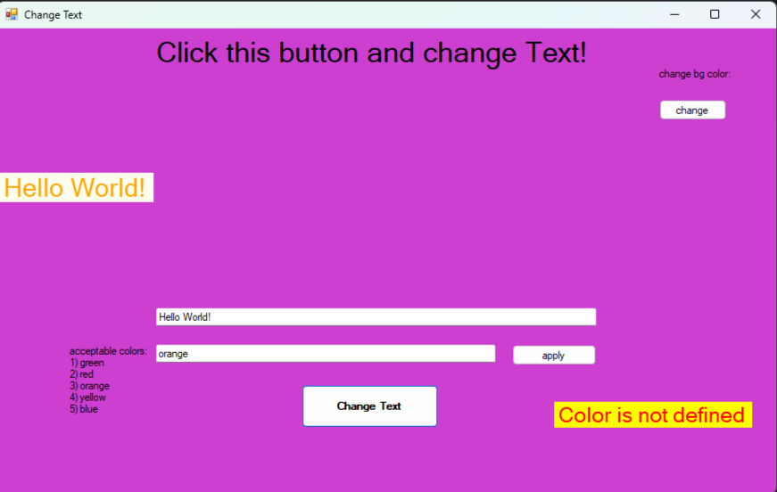

# Simple-Application-on-Windows-Forms
My first application on c# windows froms. 
The application is not perfect, but this is my first attempt to write an application in c#.

when you click the button, the text is extracted from the textbox and transferred to the screen, you can also change the background to random colors using the button in the upper right corner. The color of the text can also be changed, but you need to enter the name of the color in the textbox, there is a check for the presence of color, but it does not work perfectly.
